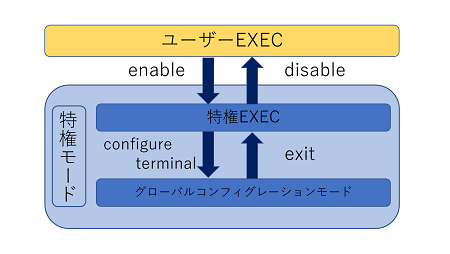

# 事前配布資料  

今回のワークショップで使いそうなワードを載せてみました。  

## ネットワークの用語  
### LAN とは
同じ建物の中や、一つの家庭などの限定された範囲で接続できるネットワークのこと。
  
### WAN とは  
遠く離れた場所と場所がつながったネットワーク。
簡単に言えば、LANとLANをつなぎます。

## IPアドレス
ネットの中の番地。プライベートIPとグローバルIPがあります。  
IPは機器に振るものではなく、インターフェースに振るものです。
IPv4とIPv6が存在しますが、今回のワークショップはIPv4をもとにしています。

  
## ネットワークを構成するもの

- ルータや、L2ハブ、サーバなどの機器
- UTPケーブルや光ファイバなどのケーブル

#### 機器
今回使う機材にはGigabit Ethernet(GiGと書かれたものなど)のポートと Fast Ethernet(FEと書かれたものなど)のポートが存在します。  
Fastは上限が100Mbps、Gigabitは上限が1Gbpsで通信します。

- スイッチングハブ
    MACアドレスを見てパケットを流してくれる


- ルータ  
    ネットワークの中継器。IPを見てパケットを流すなど、ルーティングプロトコルが扱える。


#### ケーブル
- 遠距離通信を支える光ファイバ。  
    高速通信を遠くまで敷設できる代わりに壊れやすい。  
  
- 近場のお供、UTPケーブル  
    通信の距離減衰が激しいが曲げたりできる。  
    　クロスケーブル：同種の危機(ルータとルータなど)の接続に使う  
    　ストレートケーブル：多種(ルータとPCなど)の接続に使う  
    しかし近年はautoMDI/MDI-Xがあるため、意識せずとも使うことができる  

### Ciscoルータの基本コマンド
今回のワークショップで直接触れるネットワーク機器は、CISCOのルータです。
CISCO機器はCLIで操作するため、基本的なコマンドを紹介しておきたいと思います。
コマンドの入力はtabで補完することができます。
```
conf
```
でtabをうつと
```
configure
```
まで保管してくれます。(ただし、入力しているときの文字でコマンドが特定できるときのみです)

また、`?`は入力可能なコマンドを表示してくれます。
```
interface GigabitEthernet ?
```
でエンターを押すとその下に
```
<0~8>
```
のように表示してくれます。(今回は選択可能なインターフェースが表示されています)
`?`は単語の途中でも入力することができるので、
```
int?
```
のように使うこともできます。

#### モード
CISCO のIOSではユーザーモードと特権モードの2つのアクセスレベルが存在します。  


Linuxの管理者と一般ユーザのようなもの。  
ユーザモードではコマンドが制限されている(設定の一部が確認できる程度)が、特権モードになるとすべてのコマンドが入力できます。  
ユーザモードでは` > `が表示されているときはユーザモード、` # `が表示されているときは特権EXECです。  
ユーザモードから特権モードになるためには
```
enable 
```
と入力することで入ることができる。  
  
この状態ではその機器のすべての設定を確認できる。
この状態から  
  
```
configure terminal
```

と入力することで、`グローバルコンフィギュレーションモード`になり設定を打ち込むことができる。
  
運用する際は他人から設定されたり、設定を見られたりしないようにするため、ユーザモードから特権に変わる時(`enable`をうった時)にパスワードを要求する設定になっている場合が多いです。

#### ポート・interface
CISCOのIOSの操作は階層構造になっています。  
このことは、「モード」からも感じ取ることができると思います。  
  
そのため、設定を施すためには設定する場所まで下りていく必要があります。  
例えば、GigabitEthernet 1にip アドレスを設定するときは、  
グローバルコンフィギュレーションモードからGigabitEthernet 1に移動してから設定します。コマンドにすると、  
```
(config)# interface gigabitethernet 1  
(config-if)# ip address "ここにIPアドレス" "ここにサブネット"  
(config-if)# no shutdown
```

CISCOルータは、デフォルトでインターフェースが無効化されています。  
そのために、三行目の`no shutdown`が必要になります。
そもそも`shutdown`を打ち込むとインターフェースを無効化します。  
しかし、コマンドの前に`no`を打ち込むと、その設定を消去することができます。  


#### show
設定を確認するコマンド。

```
show running-config
```
現在設定されている設定すべてを見ることができます。  
show runをコピーして張り付ければ、同じ設定をすることができます。  

```
show ip interface brief
```
インターフェースのステータスの概要を見ることができます。
IPアドレスや、IPアドレスを振った方式、ケーブルが接続されているか、通信できるかなどが記載されています。

`show ? `で確認すれば、ほかにもさまざまな情報を確認できるコマンドがあることが確認できます。

### ネットワークの技術
  
#### DHCP
IPアドレスを自動的に割り当てたり、デフォルトゲートウェイ、使用するDNSなどの情報を伝えるプロトコル。  
スマホやPCをWiFiに接続するとすぐにネットが使えるのは,  
DHCPを自動で受け取るようにデフォルトで設定されているためです。  
CISCO機器では、DHCPをはくことのできるDHCPサーバになることも、  
インターフェースごとに設定すればDHCOを受け取るDHCPクライアントになることもできます。  
GigabitEthernet 0でクライアントとしてDHCPを受け取り、  
GigabitEthernet 1でサーバとしてDHCP配ることもできます。  


#### NAT
IPアドレスを変換する技術。  
プライベートIPからグローバルIPアドレスへ変換することによく使われていて、  
IPとIPを変換してくれます。  
インサイドNATは送信元を変換し、アウトサイドNATは送信先のIPを変換します。  

また、これを応用した、NAPTもしくはPATと呼ばれるものもあります。  
これは、ポート利用して複数のIPを一つのIPに変換することができます。  
NAPTは家のルータでも使われています。  
仕組みとしては、グローバルIPの振られたインターフェースのあるルータと、  
プライベートアドレスが振られたコンピュータAがあるとします。  
コンピュータAのポートN番から通信があったとするとルータは対応するK番ポートを用意してあげることで、  
同じIPにパケットが来てもポートで識別するできます。  

  

NAPTを利用することでISPからローカルエリアあたりに一つのグローバルIPを付与するだけでよくなり、枯渇しているIPｖ４を節約することができます。


#### ACL
Access Control Listの略で、パケットの通過の許可・拒否の書かれたリストのことです。  
このリストは、上から順に見られていくので、記述する順番はとても大事です。  
リストのどの条件にも当てはまらずに最後まで通った時は、そのパケットは拒否されます。  
このことを`暗黙のdeny any`と言います。  

CISCO機器には、送信元IPのパケットをすべて許可・拒否する標準ACL、送信元IP・プロトコル・送信先IP・ポートなどを指定できる拡張ACLがあります。  


#### VLAN


#### ルーティング
ルーティングとは、通信相手までの経路を判断する仕組みです。  
ルーティングは大きく二つに分けられ、スタティックルーティングとダイナミックルーティングと呼ばれる二種類があります。  
ルータはこれらの方法を用いてルーティングテーブルと呼ばれる地図を作成します。  


スタティックルーティングとは、ルータでスタティックルートを使用したルーティングのこと。  
スタティックルートとは、管理者が宛先ネットワークへの最適なルートを手動で設定された経路のこと。  
スタティックルートの情報は他のルータへ通知されることはない。  
また、ネットワークの状態に変化があった場合でも、他に有効な宛先ルートがあっても、自動的にそのルートに切り替わることはない。  


ダイナミックルーティングとは、ルータでルーティングプロトコルを使用したルーティングのこと。
ダイナミックルートとは、ルータで設定されたルーティングプロトコルで動的に追加される経路のこと。
ダイナミックルートの情報は、ルータで設定されたルーティングプロトコルの動作に従って他のルータに対して自動的に通知される。
また、ネットワークの状態に変化があった場合、他に有効な宛先ルートがあれば自動的にそのルートに切り替わる。
ネットワーク経路の追加、変更等は全て動的に伝わる。


ルーティングプロトコルには IGP と EGP の二種類がある。
IGPは同一組織ネットワーク内のルータ同士で経路情報をやり取りする際に使うルーティングプロトコル
　RIPとRIP version2、OSPFと呼ばれるものなどがある。
EGPは異なる組織ネットワーク間で経路情報をやり取りする際に使うルーティングプロトコル
　BGPと呼ばれるものなどがある。
この「組織ネットワーク」のことを「AS」と呼ぶ。


RIPとは、
ディスタンベクタ型ルーティングプロトコルと呼ばれ、距離と方向を基準に最適経路を決定する。
ルーティングの上での指標であるメトリックは、経由するルータの数(ホップ数)で算出される。
30秒間に1回、テーブル全体を隣接ルータに通知し、ルーティングをアップデートする。
RIP version1はクラスフルルーティング、RIP version2はクラスレスルーティングを行う
    - OSPF

- EGP(説明)
    - BGP